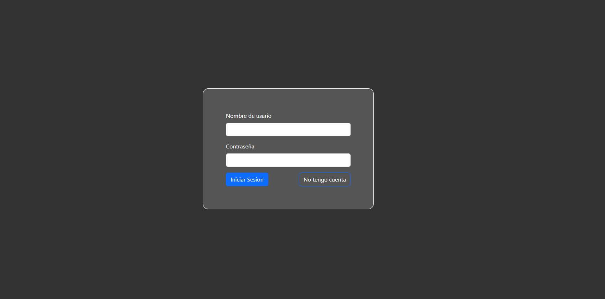
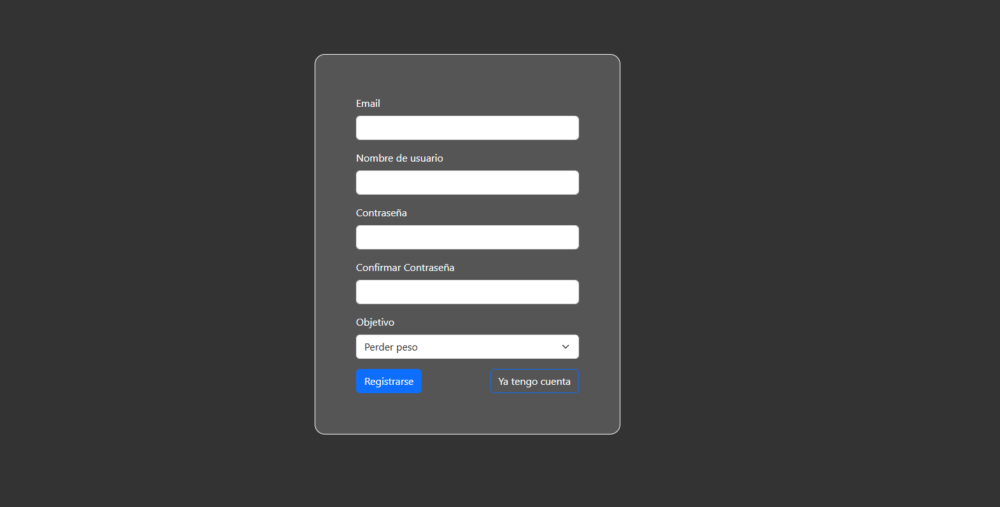
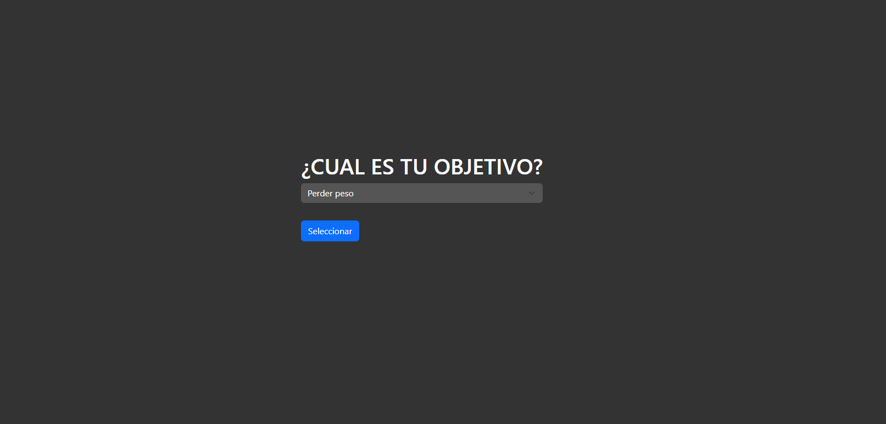
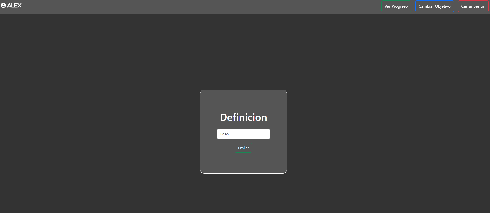
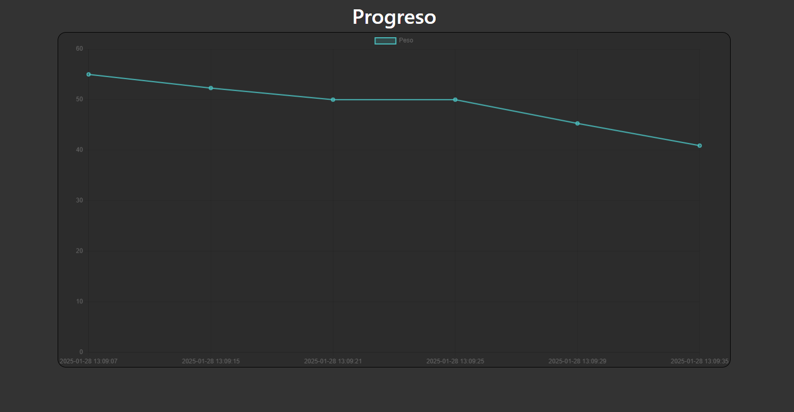

# Proyecto de Seguimiento de Peso y Objetivos 🏋️

Este proyecto es una aplicación web para el seguimiento del peso y los objetivos de los usuarios. A continuación, se muestran algunas capturas de pantalla de la aplicación.

## Capturas de Pantalla

### 1. Inicio de Sesión


### 2. Registro


### 3. Objetivos


### 3. Página Principal


### 4. Progreso



## Instalación

Para instalar y ejecutar este proyecto localmente, sigue estos pasos:

1. Clona el repositorio:
   ```bash
   git clone https://github.com/Cernada8/Weight-Progress-PHP.git

2. Crear la base de datos localmente:
 ```bash
CREATE DATABASE IF NOT EXISTS tu_base_de_datos;
USE tu_base_de_datos;

CREATE TABLE IF NOT EXISTS user (
    id INT AUTO_INCREMENT PRIMARY KEY,
    name VARCHAR(255) NOT NULL UNIQUE,
    user_pass VARCHAR(255) NOT NULL
);

CREATE TABLE IF NOT EXISTS weight (
    id INT AUTO_INCREMENT PRIMARY KEY,
    user_name VARCHAR(255) NOT NULL,
    weight DECIMAL(5,2) NOT NULL,
    date_weighted TIMESTAMP DEFAULT CURRENT_TIMESTAMP,
    FOREIGN KEY (user_name) REFERENCES user(name)
);

CREATE TABLE IF NOT EXISTS objetivo (
    id INT PRIMARY KEY,
    tipo_objetivo VARCHAR(255) NOT NULL,
    FOREIGN KEY (id) REFERENCES user(id)
);
